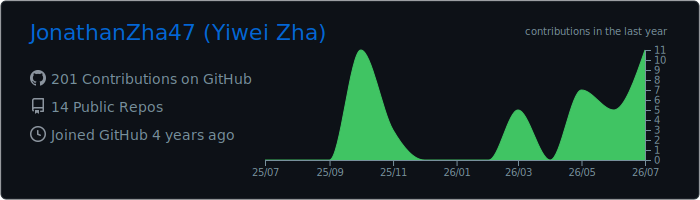
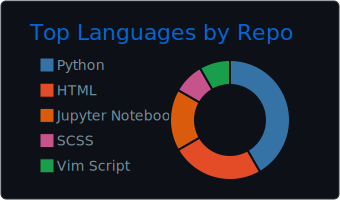
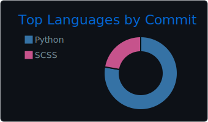
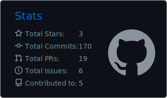
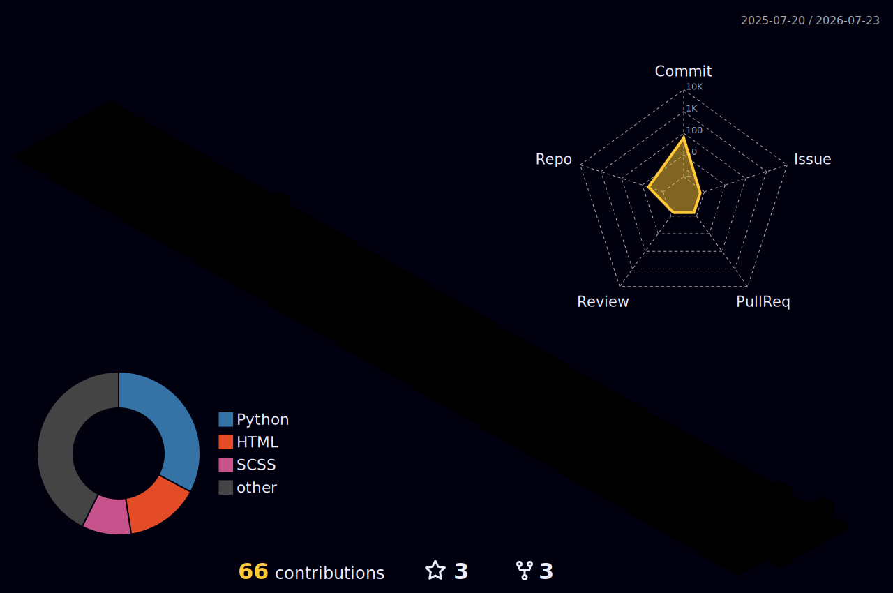

## About Me

I am a first-year PhD student at **Vrije Universiteit Amsterdam**, working on **trustworthy AI** with a particular focus on safety for agentic systems.

My current research asks how we can build safety into systems before deployment, especially when agents rely on long context windows, memory mechanisms, tools, retrieval, and compressed models. I also work across AI-generated content detection, phishing detection, retrieval-augmented generation, mobile-agent evaluation, and earlier AI-for-science systems.

<table>
  <tr>
    <td width="50%">
      <h3>Current Research</h3>
      <ul>
        <li>Memory poisoning and defenses for agent context windows</li>
        <li>Safety implications of quantization, pruning, and model compression</li>
        <li>Trustworthy AI evaluation under adversarial behavior</li>
        <li>AI-generated text detection and phishing detection</li>
      </ul>
    </td>
    <td width="50%">
      <h3>Open To</h3>
      <ul>
        <li>Collaborations on agentic-system safety</li>
        <li>LLM evaluation and benchmark design</li>
        <li>Safety-aware deployment of efficient models</li>
        <li>Research discussions around trustworthy AI</li>
      </ul>
    </td>
  </tr>
</table>

## Toolbox

## GitHub Activity

## Selected Publications

- **MobileAgentBench: An Efficient and User-Friendly Benchmark for Mobile LLM Agents**. AAAI MARW Workshop, 2025. [arXiv](https://arxiv.org/abs/2406.08184)
- **SMARTFinRAG: Interactive Modularized Financial RAG Benchmark**. arXiv preprint, 2025. [Code](https://github.com/JonathanZha47/SMARTFinRAG)
- **PADBen: A Comprehensive Benchmark for the Robust Evaluation of Paraphrase Attack Detection**. Manuscript in preparation. [Code](https://github.com/JonathanZha47/PadBen-Paraphrase-Attack-Benchmark)
- **iTransPASOH: A Physics-Aware iTransformer Framework for Lithium-Ion Battery State-of-Health Estimation**. Knowledge-Based Systems, revision.

## Connect

I am happy to talk about trustworthy AI, agent safety, evaluation, and safety-aware deployment of efficient models.

